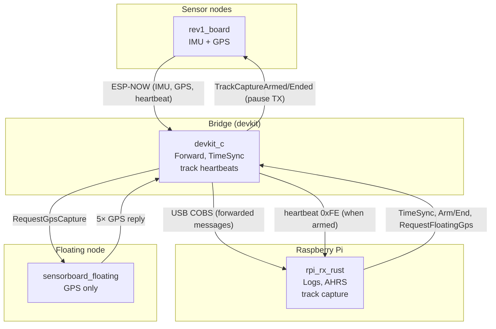

# vehicle-daq

Vehicle data-acquisition system: **ESP32-C6 sensor nodes** stream IMU and GPS over **ESP-NOW** to a **bridge**; the bridge forwards data over **USB** to a **Raspberry Pi**, which logs CSV, runs optional AHRS, and supports **track capture** (waypoint logging via a GPS-only “floating” node).

The two main software pieces are:

| Component | Location | Role |
|-----------|----------|------|
| **rpi_rx_rust** | [`sw/tools/rpi_rx_rust/`](sw/tools/rpi_rx_rust/) | Pi-side: COBS decoder, CSV logging, AHRS, track capture (GPIO or interactive). |
| **sensor_board_rev1_test** | [`sw/sensor_board/sensor_board_rev1_test/`](sw/sensor_board/sensor_board_rev1_test/) | Firmware for Rev1 DAQ nodes (sensor + floating) and for the bridge (devkit). |

---

## System overview

- **Sensor nodes** (`rev1_board`): Read IMU and GPS, send over ESP-NOW. When track capture is armed, they pause so the floating node’s packets aren’t dropped.
- **Bridge** (`devkit_c`): Receives ESP-NOW, assigns node IDs by MAC, forwards messages to the Pi over USB (COBS). Sends TimeSync to nodes; handles Arm/End track and RequestFloatingGps; when armed, sends a track-capture heartbeat (0xFE) to the Pi every 500 ms.
- **Floating node** (`sensorboard_floating`): GPS-only; on RequestGpsCapture it replies with the next 5 GPS samples for waypoint logging.
- **Pi** (`rpi_rx_rust`): Decodes COBS stream, writes raw CSV (and optional AHRS CSV). Can arm track capture, request floating GPS per waypoint, and write track files (`~/daq/tracks/<date>/<time>.csv`). Uses track heartbeats to auto-end capture if the bridge disappears; bridge auto-ends if the Pi disappears.

---

## Raspberry Pi (rpi_rx_rust)

- **Binaries**: `rpi_rx_rust` (CLI + serial), `rpi_rx_rust_gpio` (GPIO-only service), `rpi_rx_rust_track_test` (interactive track capture), `ahrs_postprocess`, `gps_extract`.
- **Default serial**: `/dev/ttyACM0`, 115200 baud (set `RPI_RX_SERIAL_PORT` if the bridge is on another port).
- **Logs**: `~/daq/logs/<date>/` (raw and AHRS); track files: `~/daq/tracks/<date>/`.
- **Track capture**: Arm → take location (request 5 GPS from floating node, average, append one row) → end. Heartbeat from bridge (0xFE) every 500 ms; 3 s without heartbeat or 2 s without USB from Pi triggers auto-end.

Full build and usage: **[sw/tools/rpi_rx_rust/README.md](sw/tools/rpi_rx_rust/README.md)**.

---

## Sensor board & bridge (sensor_board_rev1_test)

- **Binaries**: `rev1_board` (sensor node), `devkit_c` (bridge), `sensorboard_floating` (GPS-only for track capture).
- **Build** (from `sw/sensor_board/sensor_board_rev1_test/`):
  - Sensor: `cargo build --bin rev1_board` (optional `--features pos_center` etc.).
  - Bridge: `cargo build --bin devkit_c --no-default-features --features bridge`.
  - Floating: `cargo build --bin sensorboard_floating --no-default-features --features floating`.
- **HMI**: User LED (1 Hz) + NeoPixel (state/feedback). Bridge: 4× blink when armed; orange when sending request; green/rainbow on success/timeout. Floating: green breathing when idle with fix; orange when acquiring.

Full build, features, task model, and hardware init: **[sw/sensor_board/sensor_board_rev1_test/README.md](sw/sensor_board/sensor_board_rev1_test/README.md)**.

Other repos under `sw/`, `ee/`, and `vision/` may have their own READMEs.
